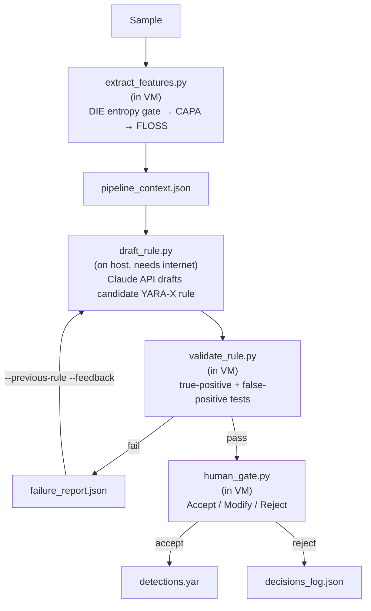

# ARGUS — Automated Rule Generation Under Supervision

**Live viewer:** [mikeperrella.github.io/ARGUS](https://mikeperrella.github.io/ARGUS/)

Reverse engineering & detection engineering portfolio project. Third in a series, following **Aegis Triage** (agentic SOC alert triage) and **VIGCAP** (GRC / identity governance).

A credible, entry-level-appropriate reverse engineering foundation, paired with a genuine detection-engineering automation pipeline: run CAPA against a real malware sample, extract indicators, draft a candidate YARA rule via the Claude API, validate it against true-positive and false-positive tests, and require a human accept/reject decision before it's treated as final. Documented as a "Detection Story" per sample rather than a checklist. The name reflects the design itself: rule generation that is automated, but never unsupervised.

## What ARGUS is explicitly not

- Not GRC (that's VIGCAP)
- Not network or cloud security (a planned fourth project)
- Not a claim to malware-analyst-level RE depth — the RE work exists to make the detection pipeline defensible, not to stand alone as expert-level reverse engineering
- Not a vehicle for resume bullets — those are built separately, once this is fully finished
- Not vulnerability research or exploit development

## Pipeline



The isolated analysis VM has no internet access by design — only `pipeline_context.json` ever needs to leave it. `draft_rule.py` runs on the host, where the Claude API call needs a real connection.

## Repository structure

```
ARGUS/
├── pipeline/
│   ├── extract_features.py      # DIE + CAPA + FLOSS, runs in the VM
│   ├── draft_rule.py             # Claude API rule drafting, runs on the host
│   ├── validate_rule.py          # yara_x compile + TP/FP tests, runs in the VM
│   ├── human_gate.py             # accept/modify/reject gate, runs in the VM
│   ├── candidate_v1.yar          # the drafted candidate rule
│   ├── candidate_v1.notes.txt    # the model's rationale for it
│   ├── detections.yar            # accepted rules
│   ├── decisions_log.json        # full accept/reject history, with reasoning
│   ├── pipeline_context.json     # combined DIE/CAPA/FLOSS output for the sample
│   ├── capa_output.json
│   ├── floss_output.json
│   ├── floss_static.txt
│   └── tightening_loop_test/     # a deliberately-broken rule used to prove the
│                                  # validate → fail → feedback → redraft loop
│                                  # works end to end (see below)
├── stories/
│   └── detection_story_agenttesla_01.md
└── screenshots/
```

## Analyzed samples

### AgentTesla — `0d736040f6fcab61ef390639d0f9deb1270c8b3492dd7abd9cdc8ec43a100364`

Full writeup: [`stories/detection_story_agenttesla_01.md`](stories/detection_story_agenttesla_01.md)

A .NET crypter/loader stub built around a custom `PrivacyShield` cipher module (ribbon/slab XOR-permutation primitives, HMAC-SHA256, `Rfc2898DeriveBytes`). Key points from the Detection Story:

- **T1620 (Reflective Code Loading)** — confirmed directly through the pipeline: CAPA matched `GetManifestResourceStream`, `Assembly::Load`, `GetMethod`, and `MethodBase::Invoke`, showing a loader that pulls an embedded resource, loads it as an in-memory assembly, and executes it without touching disk.
- **T1055.012 (Process Injection)** — originally reported only by third-party sandboxes (Joe Sandbox, Hatching Triage, Dr.Web vxCube). Manual source analysis in dnSpy traced a multi-method chain — three separately-gated methods across two classes (`GenMath`, `Utils`) — that ultimately calls `AC1_1.OrderWorkflow.ProcessFulfillment`, passing a literal path to `MSBuild.exe` and a decrypted payload, via a reflection sequence built dynamically at runtime (`DynamicMethod`/`ILGenerator::Emit`) rather than direct API calls. The actual injection logic lives inside an assembly assembled entirely in memory, so it's static evidence consistent with a likely mechanism, not a fully confirmed one — the sample was never executed as part of this project.
- **Systematic disguise pattern** — the reflective-loading and decryption logic is hidden inside multiple innocuous-looking math/utility methods (`GenMath.WeightedMedian`, `Utils.Perpendicular`) with plausible names and signatures, each independently gated. One gate (`Utils._resolvedLayerMask == 31`) turned out to be statically unreachable — the four methods that can set bits in it only ever sum to 30 — suggesting either dead/decoy code or a bug in the sample.
- **Rule**: `AgentTesla_PrivacyShield_DotNet_Crypter` — a narrow, build-specific fingerprint of this crypter's naming scheme, not a durable AgentTesla-family detection. Full blind-spot analysis in the Detection Story.

### Tightening-loop verification

The validate → fail → feedback → redraft loop had never been exercised (the one real pipeline run passed validation on the first attempt). To prove it works, a copy of the accepted rule was deliberately broken (`tightening_loop_test/candidate_v1_broken_test.yar`), run through the full loop, and confirmed to pass validation again after redrafting (`tightening_loop_test/candidate_v2.yar`). The redraft was ultimately rejected at the human gate — it was a valid demonstration of the mechanism, not a genuine second finding, and accepting it would have left a redundant entry in `detections.yar`. Full artifacts and reasoning are in `pipeline/tightening_loop_test/` and `decisions_log.json`.

## Environment

**Host:** Windows 11, VMware Workstation Pro, isolated host-only network (VMnet2, no host adapter, no DHCP), REMnux gateway/sinkhole running INetSim.

**Analysis VM:** Windows 11 Pro, static IP on the isolated network, Defender fully and durably disabled via Group Policy (the broader "Turn off Microsoft Defender Antivirus" policy alone wasn't sufficient — the more specific real-time-protection policy was required).

**Tools:** Ghidra 12.1.x, Mandiant CAPA v9.4.0, FLARE-FLOSS v3.1.1, Detect It Easy v3.21, YARA-X 1.20.0, x64dbg, dnSpyEx, 7-Zip. Ghidra and x64dbg were installed as planned but proved poorly suited to this specific sample — it's a .NET binary, where dnSpy's IL-to-C# decompilation offers far more insight than native disassembly. dnSpy was used for the actual manual code analysis instead.

## Usage

```
# Inside the VM (no internet needed)
py extract_features.py "C:\path\to\sample.exe"

# On the host (needs internet, ANTHROPIC_API_KEY set)
py draft_rule.py pipeline_context.json --out candidate_v1.yar

# Inside the VM
py validate_rule.py candidate_v1.yar --sample "C:\path\to\sample.exe"
py human_gate.py candidate_v1.yar
```

If validation fails, feed the failure report back in for a tightening pass:
```
py draft_rule.py pipeline_context.json --out candidate_v2.yar \
    --previous-rule candidate_v1.yar --feedback failure_report.json
```

## License

See [LICENSE](LICENSE).
